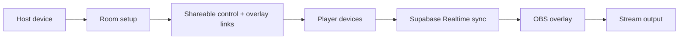

# LifeLink

[](https://github.com/lifelinkmtg/lifelink)
[](https://react.dev/)
[](https://www.typescriptlang.org/)
[](https://tailwindcss.com/)
[](https://vitejs.dev/)

## Features
- Cloud-synced rooms with shareable control + overlay links.
- Life, commander damage, poison, energy, and experience tracking.
- Monarch, initiative, and day/night indicators.
- Preset playgroups for quick setup.
- Dice roller for fast starts and random decisions.
- Customizable overlay layout for OBS and streaming tools.
- Realtime sync across all players and devices.

## Quickstart
**Requires:** Node.js 18+
```bash
npm install
npm run dev
```

## Configuration
| Variable | Required | Description |
| --- | --- | --- |
| `VITE_SUPABASE_URL` | Yes | Supabase project URL used by the frontend client. |
| `VITE_SUPABASE_PUBLISHABLE_KEY` | Yes | Supabase anon/publishable key. |

## How it works
- You create a room and pick the player count.
- LifeLink generates shareable links for player control and OBS overlay.
- The UI syncs life totals and counters through Supabase Realtime.
- The overlay updates instantly across all connected devices.



## Usage examples
Try these table setups:
1. 4-player Commander with commander damage enabled.
2. 2-player 20-life duel with poison tracking.
3. 3-player game using monarch + initiative indicators.
4. 4-player pod with a shared dice roll for first player.
5. Custom overlay layout tuned for vertical streams.

## Self-hosting notes
LifeLink is built to be self-hosted. Forks should rename the project and remove LifeLink branding when deployed publicly.

## Deployment and secrets
This repository does **not** include production credentials. Real environment files are ignored by Git and must be provided by operators.

Use a local `.env` file to configure your own instance.

## Troubleshooting
- **Missing environment variables**: Ensure `.env` is populated with the required Supabase settings.
- **Overlay not updating**: Confirm all devices are connected to the same room link.
- **Realtime sync issues**: Verify Supabase keys and project URL.

## Contributing
Contributions are welcome! Open an issue or submit a pull request with your proposed changes.
